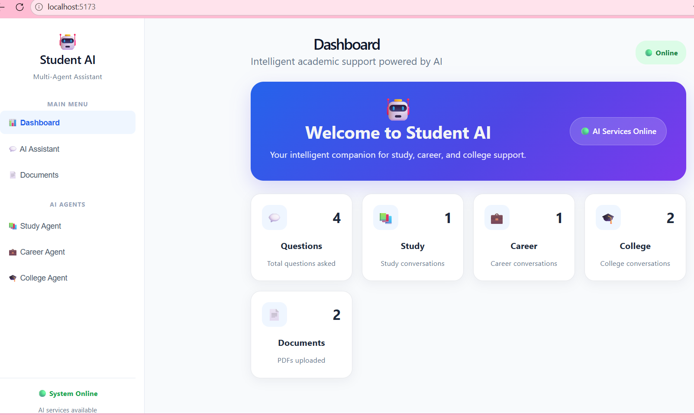
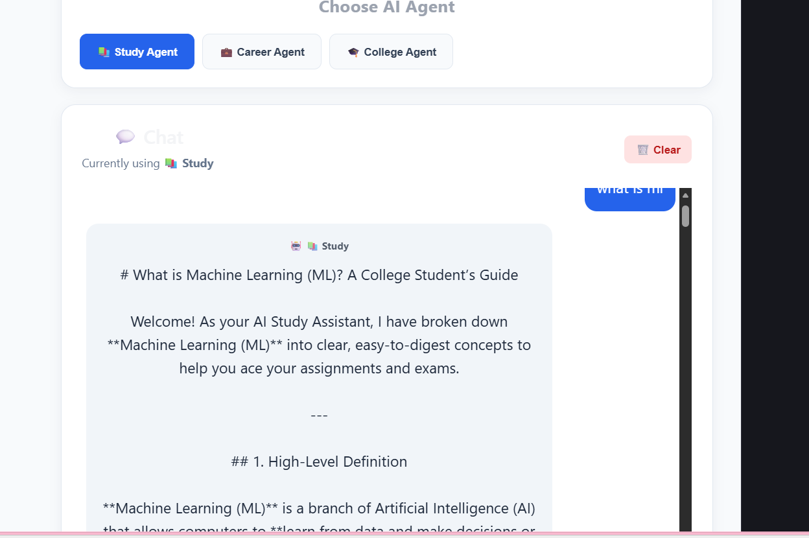
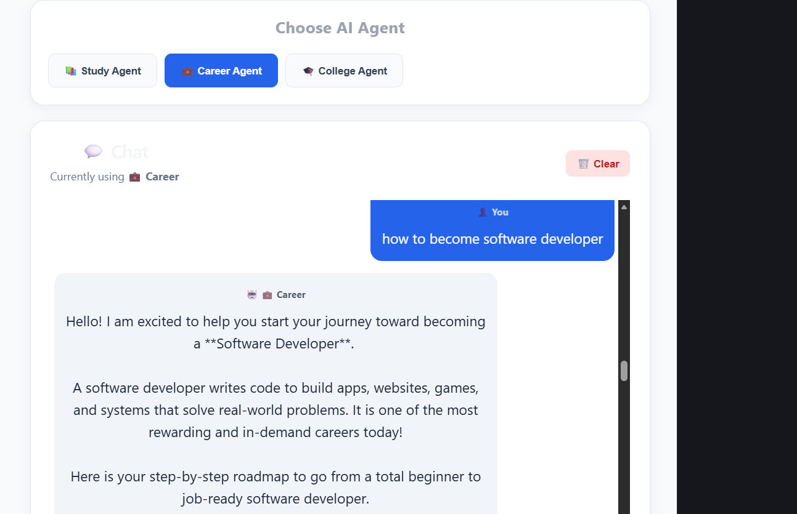
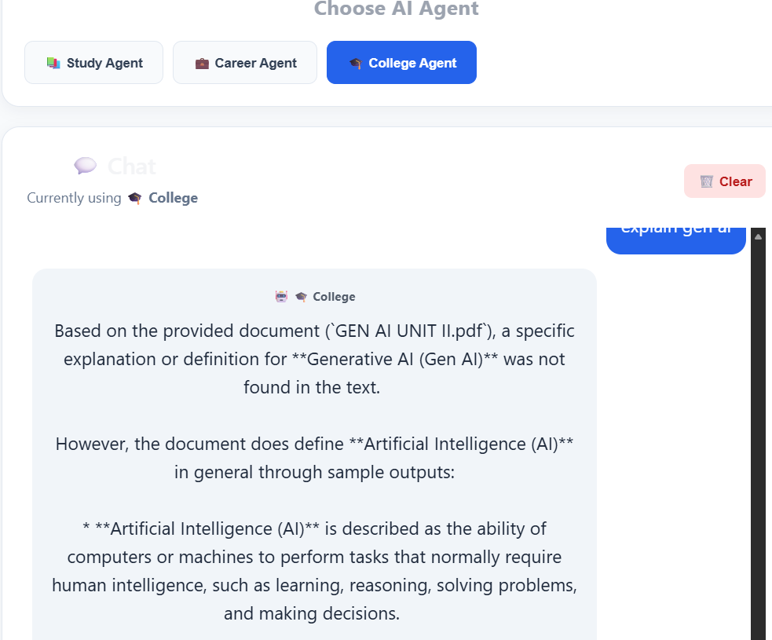
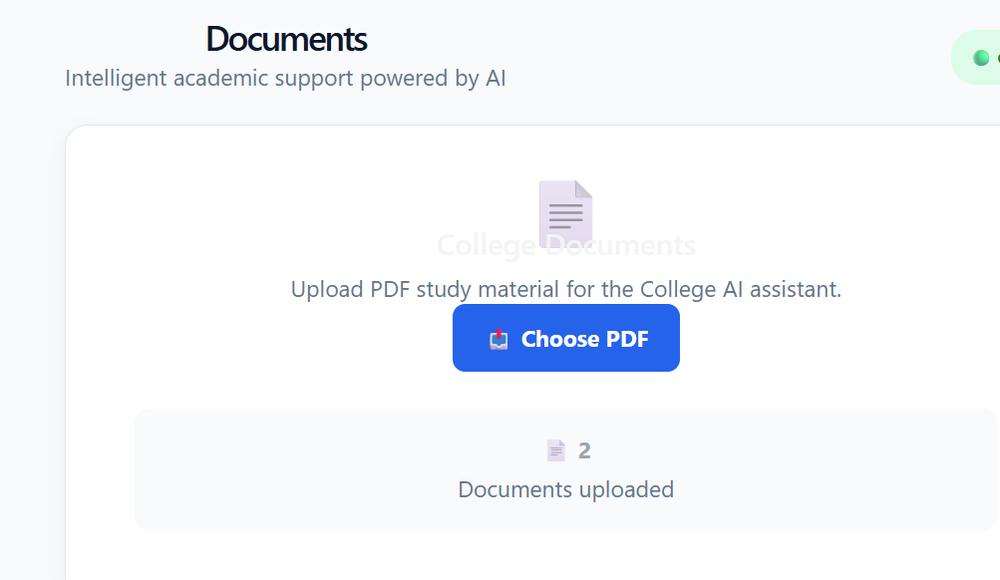

# 🤖 Student AI — Multi-Agent Student Assistant

An AI-powered student assistant that provides personalized support for **study, career, and college-related queries** using specialized AI agents.

---

## ✨ Features

### 📚 Study Agent

- Academic concept explanations
- Exam preparation
- Technical questions
- Simple and structured answers

### 💼 Career Agent

- Career guidance
- Interview preparation
- Resume guidance
- Skill development suggestions

### 🎓 College Agent

- College-related assistance
- Study material support
- PDF document processing
- Academic assistance

### 📊 Dashboard

- Total questions
- Study questions
- Career questions
- College questions
- Uploaded documents
- AI service status

### 📄 PDF Upload

Upload college study materials in PDF format for use with the College AI assistant.

### 💬 Chat System

- Interactive AI chat
- Agent selection
- Chat history
- Clear chat
- Enter-to-send
- Loading indicators

---

## 🖥️ Screenshots

### 📊 Dashboard



### 📚 Study Agent



### 💼 Career Agent



### 🎓 College Agent



### 📄 PDF Upload



---

## 🔐 User Authentication

The application includes secure user authentication.

### Features

- User registration
- Full name
- Email
- Password
- User login
- User logout
- Authentication-based access

### Authentication Flow

```text
        ┌──────────────────┐
        │      Student     │
        └────────┬─────────┘
                 │
                 ▼
        ┌──────────────────┐
        │ Register / Login │
        └────────┬─────────┘
                 │
                 ▼
        ┌──────────────────┐
        │ Authentication   │
        │     System       │
        └────────┬─────────┘
                 │
                 ▼
        ┌──────────────────┐
        │    Dashboard     │
        └──────────────────┘
```

---

## 👩‍💻 Developer

**Athi Jahnavi**

B.Tech Final Year Student

GitHub: **jahnaviathi7**

---

## 📜 License

This project is licensed under the **MIT License**.

See the [LICENSE](LICENSE) file for the complete license terms.

---

## 🏗️ System Architecture

```text
                    ┌──────────────────────┐
                    │      Student AI      │
                    │     Web Interface    │
                    └──────────┬───────────┘
                               │
                               ▼
                    ┌──────────────────────┐
                    │       FastAPI        │
                    │       Backend        │
                    └──────────┬───────────┘
                               │
              ┌────────────────┼────────────────┐
              │                │                │
              ▼                ▼                ▼
        ┌──────────┐     ┌──────────┐     ┌──────────┐
        │  Study   │     │  Career  │     │ College  │
        │  Agent   │     │  Agent   │     │  Agent   │
        └────┬─────┘     └────┬─────┘     └────┬─────┘
             │                │                │
             └────────────────┼────────────────┘
                              ▼
                    ┌──────────────────────┐
                    │      Gemini AI       │
                    │      AI Service      │
                    └──────────┬───────────┘
                               │
                               ▼
                    ┌──────────────────────┐
                    │     AI Response      │
                    └──────────────────────┘
git add README.md LICENSE
git commit -m "Update professional README and license"
git pull --rebase origin main
git push origin main